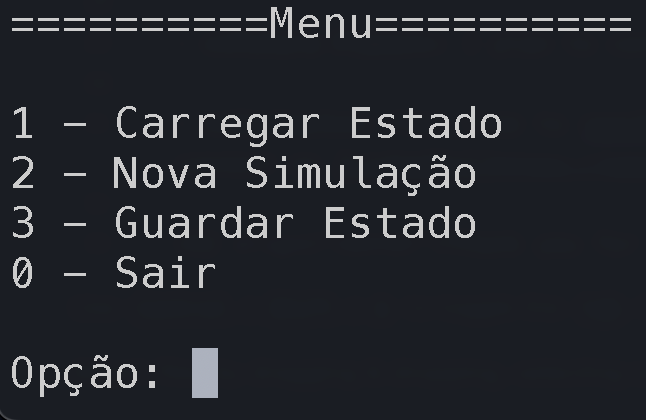
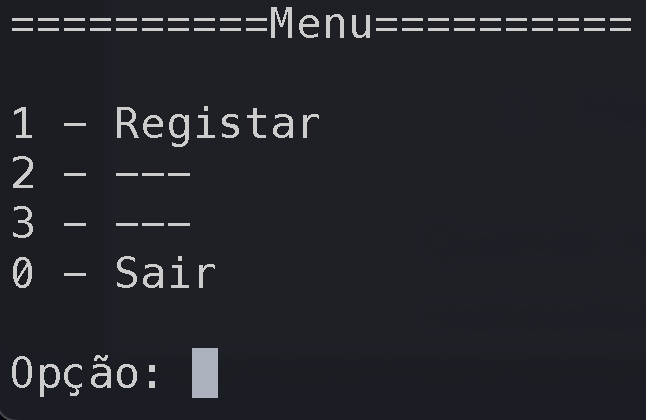
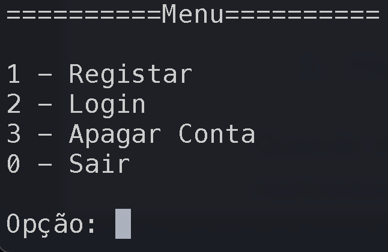
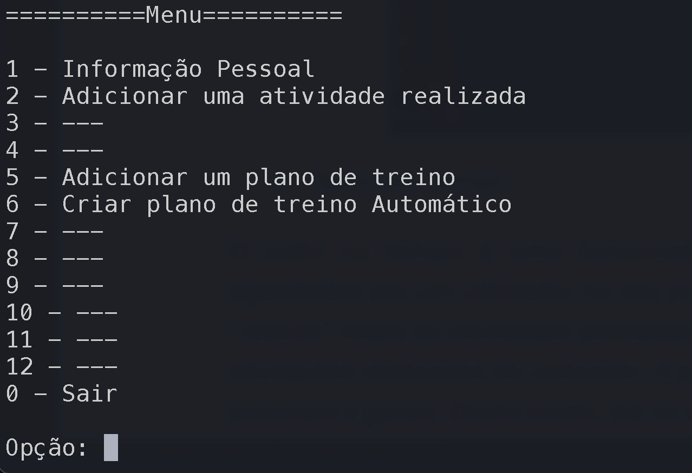
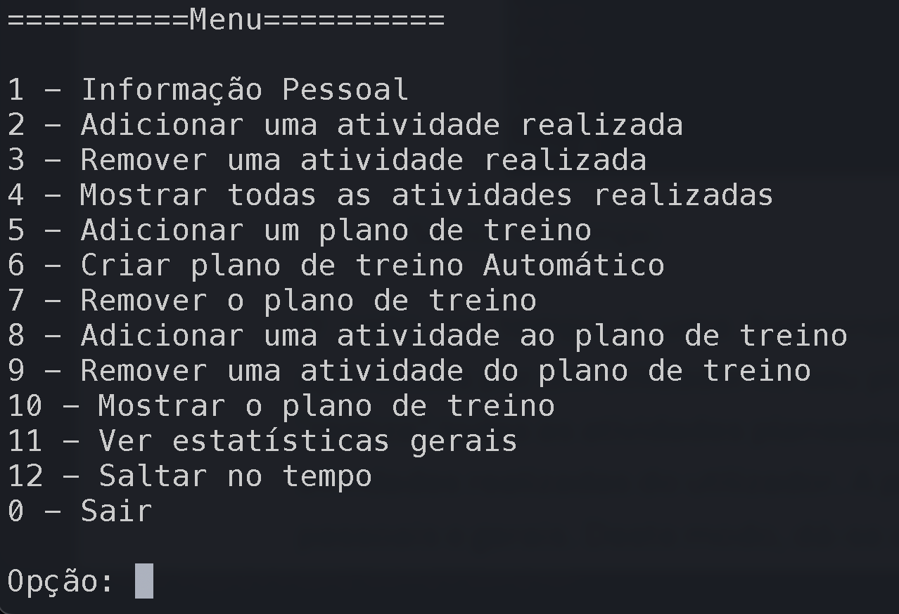
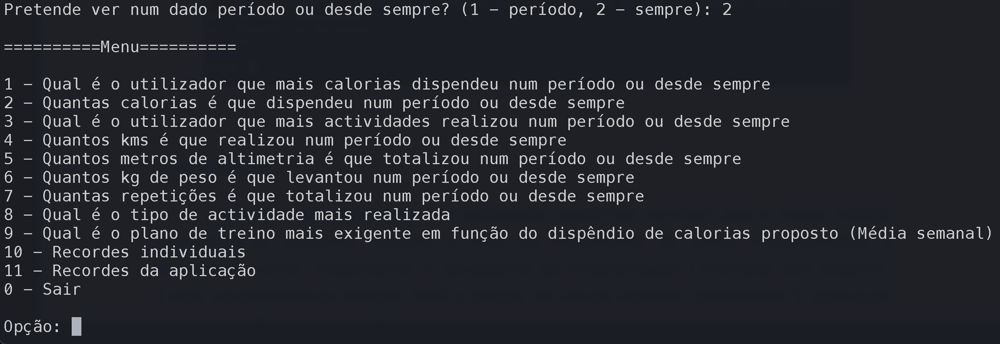

<h1 align="center">Programação Orientada aos Objetos</h1>

<h3 align="center">Made using the Java programming language during the 2st semester of the 2nd year</h3> 

<h1 align="center">Final Grade: 18/20💫</h1>

## About

A fitness app for planning, tracking workouts, and sharing progress with the community made for our [POO](https://www.di.uminho.pt/~jno/sitedi/uc_8504P4.html) class.


## Features

- User login system, that keeps its information logged in a separate file
- Individual activities tracking
- Automatic workout plan creation, based on the calorie goals of the user
- Time-jumping simulation
- Activity´s global and individual records 

## Preview
<h3 align="center"> Main menu</h3> 

<p align="center">
  
</p>


<h3 align="center"> Register/Login menu</h3> 
<div style="display: flex;" align=center>
  
  
</div>


<h3 align="center"> Activity menu</h3> 
<div style="display: flex;" align=center>
  
  
</div>  

<h3 align="center"> Records menu</h3> 
<p align="center">
  
</p>


## Usage
```bash
cd src
javac Fitness.java
java Fitness
```

## Final Notes

In this repo you will find the file "ficheiroComEstado", which has a prepared simulation ready to use, with the following instructions.

```
Os utilizadores possuem planos de treino diferenciados, onde houve um avanço no tempo de 60 dias. Por causa disso, alguns dos planos de treino já se encontram realizados. A título de exemplo, o plano de treino mais exigente (calculado a partir do número de calorias do plano a dividir pelo número de semanas) é um plano de treino já realizado, ou seja, não apresenta atividades por realizar na lista de atividades.

nome de utilizador - password
dudu               - 1234
nuno               - 1234
carol              - 1234
joao               - 1234
maria              - 1234
rodri              - 1234
ana                - 1234
```


## Group 47
The members of this group who contributed to this project were:
- <a href="https://www.github.com/Cerqueira025">Ana Cerqueira</a>
- <a href="https://www.github.com/2101dudu">Eduardo Faria</a>
- <a href="https://www.github.com/NunoMRS7">Nuno Silva</a>
